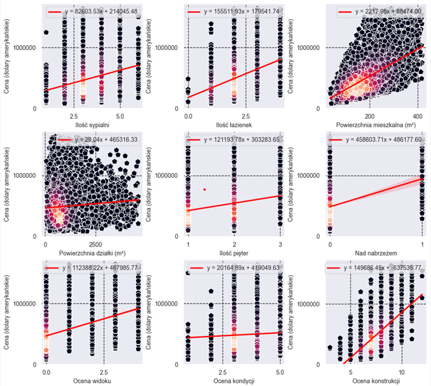

# Real Estate Price Estimation Application Project Using Machine Learning Methods


## Description:
The project aimed to demonstrate the capabilities of data analysis and machine learning in the context of real estate price estimation.

## Dependencies:

``` python
ipykernel = "==6.23.1"
pandas = "==1.5.3"
scikit-learn = "==1.2.2"
seaborn = "==0.12.2"
graphviz = "==0.20.1"
pyflowchart = "==0.3.1"
notebook = "==7.0.3"
```

## Installation and Launch Instructions:
1. Install Python version 3.9.x.
2. Install pipenv using the command: "**python -m pip install pipenv**".
3. Create a virtual environment and install the dependencies using the command: "**pipenv install**", executed in the main project folder.
4. Open the file model_training.ipynb using Jupyter Notebook, Jupyter Lab, or any environment or software that allows for cell execution. Remember to choose the interpreter from the virtual environment created in the previous step.
5. Run the cells in the file sequentially. The *kc_house_data.csv* dataset will be analyzed and processed, and based on the extracted data, selected machine learning models will be trained and saved.
6. Run the last cell - it will launch a simple GUI application that loads the previously saved machine learning model and, based on the features provided in the text fields, will estimate the property price.

## Sources:
 - Dataset used in the project: [kc_house_data.csv](https://www.kaggle.com/datasets/shivachandel/kc-house-data)
